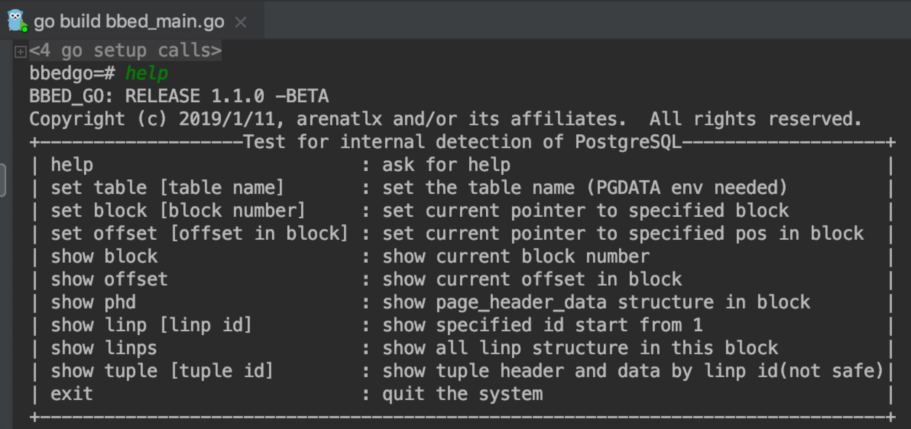
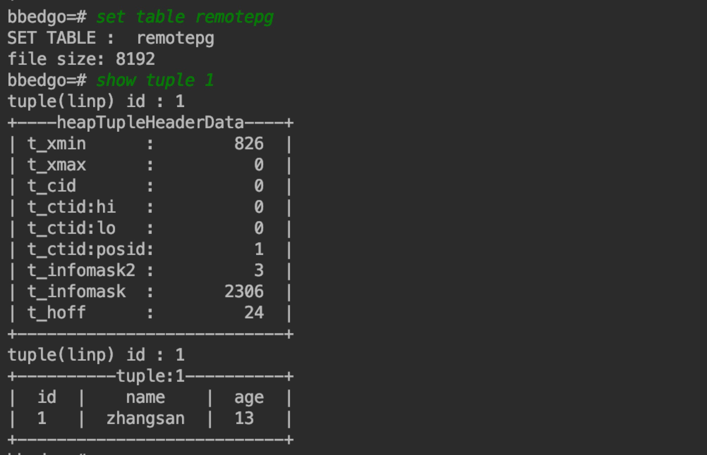

### bbedgo for PostgreSQL

**好吃又好玩的块解析工具bbed**

------------
- **help** ：提示所有操作选项
- **set block [block_number]** ：设置当前session的块号，块号从0开始
- **set offset [in_block_offset]** ：设置块内偏移，可以查看特定的元组
- **show table [table name]** : 显示需要进行解析的表名
- **show block** ：显示当前的block_num]
- **show phd** ：显示当前页头PageHeaderData
- **show linps** ：显示当前的所有的linp
- **show linp [valid linp id]** ：显示当前指定的linp
- **show tuple [valid tuple id (can use linp id) ]** ：实现指定的元组

`[id] means the order num in the total(start from 1)`
`[block & offset] (start from 0)`

------------
**Attention**：
>0: 需要在首页填入你的数据库的配置信息，因为我们需要联机去抽取一些模式，属性，长度，表的路径信息。

>1: set table [table name] 需要在第一时间做，因为需要抽取oid构建模式信息，模式长度和表的path（这里需要注意，我需要环境变量中有PGDATA的信息，不然path会构建失败）

>2: 默认会抽取表的第一个块（8192B），您可以使用set block来设置，抽取表的第几个块，然后之后的操作都会在这个块上进行解析。

>3：当前仅仅支持int32和varchar(小数)存储的元组的解析操作，当varchar中涉及大数时候，可能导致varlena的使用的4字节（小数是用1个字节某些位）长度表示，此外还可能会涉及到toast的压缩和线外存储，这部分暂时还没有考虑（实现具有一定的复杂性）。

>4：可以手动添加内置【定长】的解析函数，就可以实现扩展了，如int16等。

>5：因为手动设置offset来定位元组不直观，所以我们虽然保留这一接口，但是却没有实现它。所以通过设置linp位置顺序号来直接指向元组。因为update和vaccum的关系，linp可能作为hot chain机制的一部分，并不指向实际的元组，可能指向其他的linp，这个时候可能会导致元组解析的失败。

>6：由第三点易知：linp数 != 元组数量，详细的细节可以参照PostgreSQL源码部分的hot chain更新部分。

>7：本代码仅仅是提供一种PG块解析的思路，希望能够抛出引玉，一起交流学习。

------------

